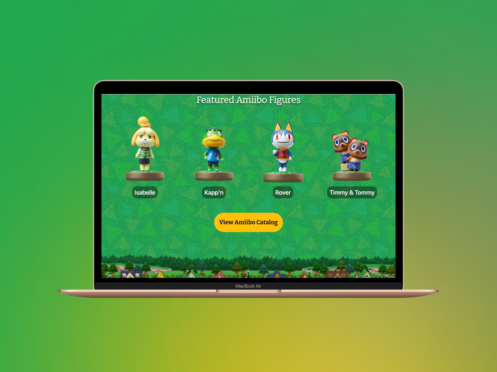

# My First Bootstrap Web Site

This is a web project developed using Bootstrap to create an interactive website. The site includes elements like a navigation bar, a carousel, featured game cards, featured Amiibo figures, and more.

## Project Summary

This project is an example of a basic website created with Bootstrap. Here's an overview of the key sections of the project:

- **Navigation Bar**: The top navigation bar allows users to easily navigate the site. It includes links to the Home, Summer Pack, About, Register, and Sign-in pages.

- **Carousel**: The carousel on the homepage displays attractive images and automatically transitions to highlight relevant content.

- **Ribbon**: A special section displays a highlighted message, such as Samson's birthday in this example.

- **Featured Games**: This section showcases cards for featured Animal Crossing games with images and descriptions.

- **Featured Amiibo Figures**: Images and names of featured Amiibo figures are displayed.

- **Play Nintendo**: A section that showcases cards of related content featuring Isabelle and friends on Play Nintendo.

- **Footer**: The footer includes a Customer Support button and provides copyright information and important links.

## Technologies Used

- HTML5
- CSS3
- Bootstrap
- JavaScript (for interactive features)

## Acknowledgments

- This project was created as a learning exercise and follows the structure and design principles of Bootstrap.
- Images used in this project are for demonstration purposes only and are not intended for commercial use.

## Screenshots

Here are some previews of our platform:

## Contact

For more information, feel free to get in touch with us:

- LinkedIn: [Juan Diego Molano](https://www.linkedin.com/in/juandmolanof/)
- Website: [www.juanmolano.netlify.app](https://juanmolano.netlify.app/)
